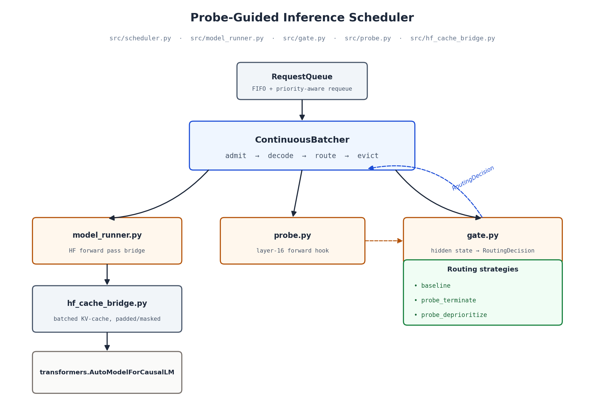
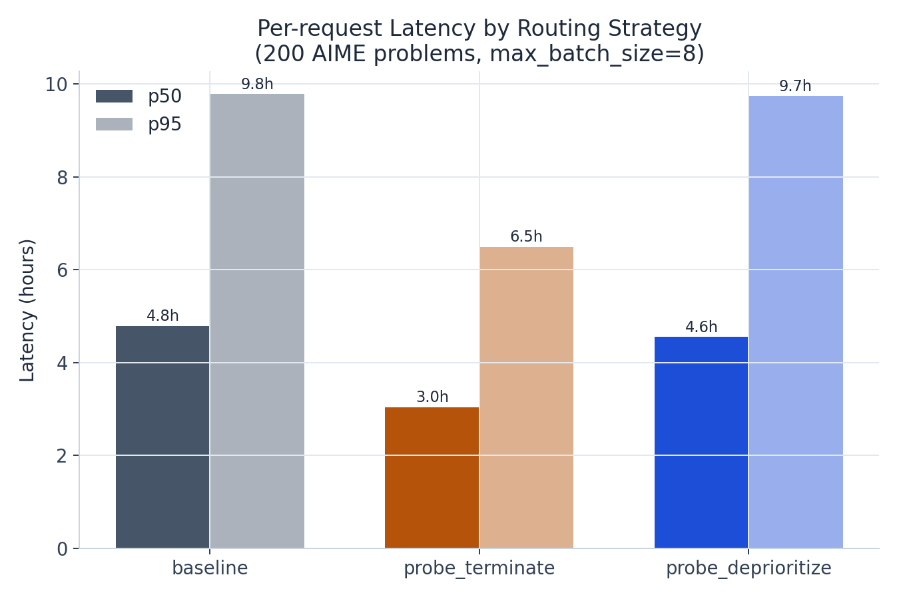
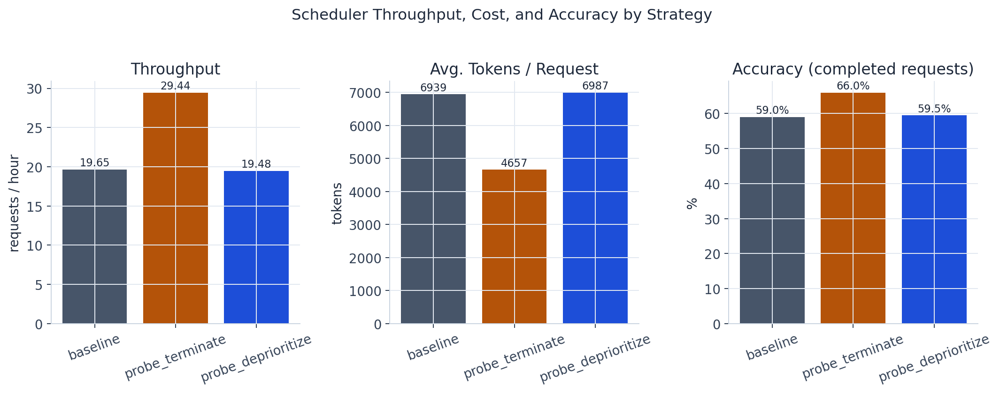
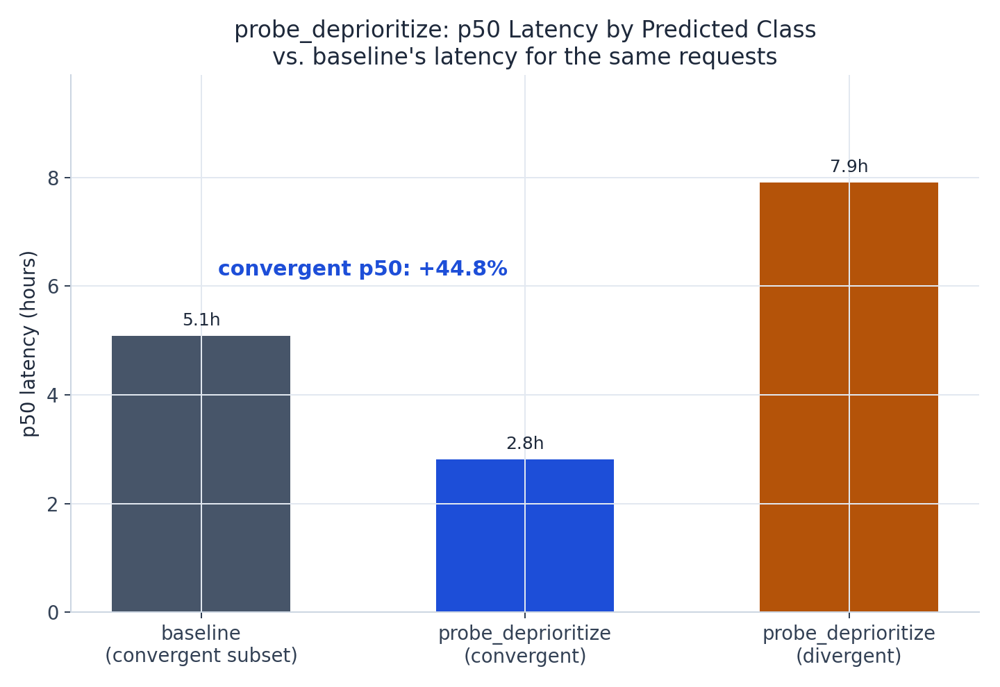
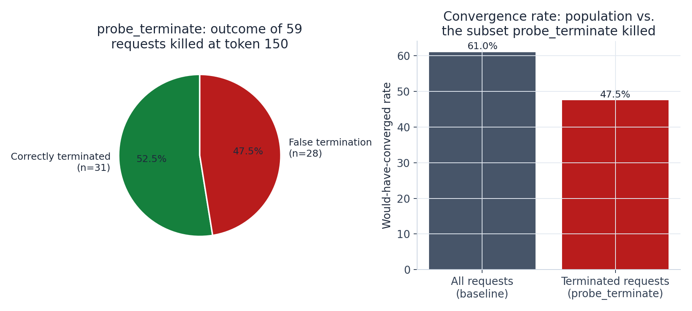

# Probe-Guided Inference Scheduling

A continuous-batching inference scheduler for `DeepSeek-R1-Distill-Qwen-7B` that routes requests using a linear probe on the model's own hidden states, rather than on request metadata alone.

## Overview

Reasoning models exhibit a bimodal failure pattern on hard math problems: generations either converge cleanly to an answer or enter a non-converging loop that runs to the token cap. [early_detection](../early_detection) showed that a linear probe on layer-16 hidden states, read at token 150 of the generation, predicts which outcome a given generation will have — AUC 0.612 vs. 0.445 for a behavioral-only baseline (p=0.001) in that project's original run.

This project turns that signal into a scheduling decision. `src/gate.py` wires the probe into a continuous-batching scheduler (`src/scheduler.py`, adapted from [inference-server](https://github.com/oladri-renuka/inference-server)'s admit/decode/evict design and rebuilt around a real 7B HuggingFace model — see [docs/ARCHITECTURE.md](docs/ARCHITECTURE.md)). At token 150 of every active generation, the gate classifies it `convergent` / `divergent` with a confidence score, and the scheduler acts on that classification under one of three strategies:

| Strategy | Behavior |
|---|---|
| `baseline` | Standard continuous batching. The routing decision is computed but never acted on — control condition. |
| `probe_terminate` | Generations classified `divergent` above a 0.7 confidence threshold are terminated at token 150. |
| `probe_deprioritize` | Generations classified `divergent` are deprioritized: preempted (recompute-based) to free batch slots for normal-priority requests once the batch is at capacity, but never discarded. |

| | |
|---|---|
| Model | `deepseek-ai/DeepSeek-R1-Distill-Qwen-7B` |
| Probe | Layer 16, checkpoint 150 (logistic regression, fit in `scripts/train_probe.py`) |
| Benchmark | 200 AIME problems, identical traffic across all three strategies |
| Hardware tested | RunPod A40 (48GB) |

## Architecture



```
probe-guided-inference/
├── src/
│   ├── config.py             # model, layer, checkpoint, thresholds, batch size
│   ├── probe.py               # loads the fitted probe; registers the layer-16 forward hook
│   ├── gate.py                 # hidden state -> RoutingDecision(label, confidence)
│   ├── queue.py                # GenerationRequest + RequestQueue (priority-aware requeue)
│   ├── hf_cache_bridge.py      # batched KV-cache bridge for heterogeneous-length decode steps
│   ├── model_runner.py         # bridges GenerationRequest <-> HF forward calls; fires the gate
│   ├── scheduler.py            # ContinuousBatcher: admit / decode / route / evict
│   └── server.py               # FastAPI: /generate, /stream, /health, /metrics
├── scripts/
│   ├── train_probe.py          # fits + exports the probe artifact from early_detection's activations
│   ├── verify_setup.py         # pre-flight check: model, probe, hook, cache-bridge parity
│   ├── plot_results.py         # generates the figures in results/ from report_summary.json
│   └── render_architecture_diagram.py
├── benchmark/
│   ├── aime_loader.py          # same 200 AIME problems, same seed, as early_detection
│   ├── routing_eval.py         # runs all three strategies against identical traffic
│   └── report.py               # throughput / accuracy / false-termination tables
├── tests/                      # CPU-only, offline (see Testing)
├── docs/ARCHITECTURE.md        # design decisions
├── probe_weights/               # fitted probe artifact
└── results/                     # benchmark output + figures
```

See [docs/ARCHITECTURE.md](docs/ARCHITECTURE.md) for the design rationale behind each non-obvious decision — most significantly, why the model is served through unmodified HuggingFace `transformers` rather than a hand-rolled forward pass (ADR 1), how the batched KV-cache bridge is built on top of that constraint (ADR 2), and why `probe_deprioritize`'s preemption is recompute-based (ADR 4).

### Request lifecycle

1. A request is admitted into the active batch (`ContinuousBatcher._try_admit`) and decoded one token at a time in a shared batched forward pass (`model_runner.run_decode_step`).
2. The moment a request has generated its 150th token, `ClassificationGate` reads that token's layer-16 hidden state (captured via a forward hook in `probe.py`) and classifies it. This happens once per request, not once per tick.
3. `ContinuousBatcher._apply_routing` reacts to the classification according to the active strategy — confidence-thresholded termination for `probe_terminate`, or a priority flag that triggers preemption under contention for `probe_deprioritize`.
4. `benchmark/routing_eval.py` runs all three strategies against the identical 200 AIME problems, and `benchmark/report.py` aggregates the comparison, including `probe_terminate`'s false-termination rate (measured against `baseline`'s outcome for the same problems, since decoding is greedy and deterministic) and `probe_deprioritize`'s convergent-vs-divergent latency breakdown.

## Setup

```bash
git clone <this repo>
cd probe-guided-inference
bash setup_runpod.sh
source venv/bin/activate
```

Requires a CUDA GPU with ≥24GB VRAM for the 7B model; ~20GB disk for model weights + checkpoints.

## Usage

```bash
# Pre-flight check: model, probe, hook, and cache-bridge parity against
# model.generate() -- run before anything else on a new GPU.
python scripts/verify_setup.py

# Fit and export the probe from early_detection's activation checkpoints
python scripts/train_probe.py --early-detection-dir ../early_detection

# Run all three strategies against the same 200 AIME problems
python -m benchmark.routing_eval --out results/routing_eval.json

# Aggregate into tables + diagnostics
python -m benchmark.report --in-path results/routing_eval.json --out results/report.md

# Regenerate the figures below
python scripts/plot_results.py
```

`Makefile` wraps each step (`make verify`, `make train-probe`, `make benchmark`, `make report`). To serve one strategy over HTTP:

```bash
PGI_STRATEGY=probe_deprioritize uvicorn src.server:app --host 0.0.0.0 --port 8000
```

## Results

200 AIME problems, `max_batch_size=8`, seed 42, identical traffic across strategies. Probe: layer 16, checkpoint 150, 5-fold CV AUC 0.567 ± 0.051 on this run's own generation output.

| Strategy | Wall-clock | Throughput | Avg tokens/req | Accuracy (completed) | p50 latency | p95 latency |
|---|---|---|---|---|---|---|
| `baseline` | 10.2h | 19.65 req/hr | 6,939 | 59.0% | 4.8h | 9.8h |
| `probe_terminate` | 6.8h | 29.44 req/hr | 4,657 | 66.0% | 3.0h | 6.5h |
| `probe_deprioritize` | 10.3h | 19.48 req/hr | 6,987 | 59.5% | 4.6h | 9.7h |




### probe_deprioritize

Convergent-predicted requests (n=126) saw a p50 latency of 2.8h, vs. 5.1h for the same requests under `baseline` — a **44.8% reduction**. Accuracy was unaffected (59.5% vs. 59.0%) and no request was dropped (200/200 finished either way). The cost is concentrated in the divergent-predicted group (n=74), whose p50 latency rose to 7.9h from 75 recompute-based preemptions. Aggregate wall-clock across all 200 requests is roughly unchanged from `baseline` (10.3h vs. 10.2h) — this strategy reallocates latency toward likely-successful requests rather than increasing total throughput.



### probe_terminate

Of the 59 requests terminated at token 150, 28 (47.5%) would have converged had they continued, per `baseline`'s run of the same problems. `accuracy_on_completed` still rose (66.0% vs. 59.0%) because the terminated set still skewed toward non-convergent generations (47.5% would-have-converged vs. 61.0% in the full population) — but a false-termination rate this close to 50% means roughly half of the compute saved comes at the cost of a discarded correct answer, with no way to recover it.



### Interpretation

The two strategies tolerate the same probe very differently because their failure costs are asymmetric. A wrong `probe_deprioritize` decision costs time; a wrong `probe_terminate` decision permanently discards a correct answer. At this probe's AUC (0.567), that difference is enough to make one strategy a clear net positive and the other not defensible as implemented: reordering is robust to a noisy signal, termination is not.

**Caveats**: single run, single seed — the false-termination rate (28/59) and the latency delta are point estimates, not confidence intervals. This run's probe AUC (0.567) is lower than early_detection's originally reported 0.612; both are within the variance that project documented across runs, but it means the `probe_terminate` result here is closer to a worst case for this methodology than a best case. Absolute wall-clock times are inflated by a known inefficiency in the KV-cache bridge (full cache rebuild every decode tick rather than only on admission/eviction — ADR 2); this affects all three strategies equally and does not change the relative comparison.

## Testing

```bash
pytest tests/ -v
ruff check .
```

The test suite builds a real, randomly-initialized `Qwen2ForCausalLM` at a tiny size (`tests/conftest.py`) rather than downloading a checkpoint, so it runs offline in under a second while still exercising the production `transformers` Cache API and attention path. It validates scheduler and cache-bridge correctness; it does not validate probe AUC or throughput, which require the real model on a GPU.

## Limitations

- No paged attention — memory scales with `max_batch_size × sequence length`, not a fixed pool (see ADR 2).
- Greedy decoding only.
- Preemption is recompute-based, not swap-based (ADR 4); under sustained contention this can inflate the deprioritized group's total compute, not just its latency.
- Single model, single hardware target; unvalidated beyond `DeepSeek-R1-Distill-Qwen-7B` on an A40/A5000-class GPU.

Full list: [docs/ARCHITECTURE.md](docs/ARCHITECTURE.md#known-limitations).

## Related projects

- [early_detection](../early_detection) — the probe methodology and its original AUC results
- [inference-server](https://github.com/oladri-renuka/inference-server) — the continuous-batching scheduler design this project adapts
- [token-efficiency-math-reasoning](https://github.com/oladri-renuka/token-efficiency-math-reasoning) — the AIME dataset loader and bimodal-convergence framing both of the above build on
